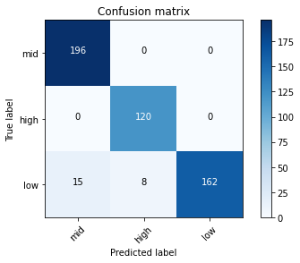
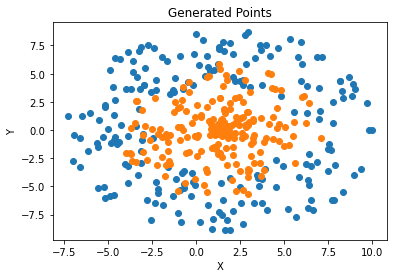
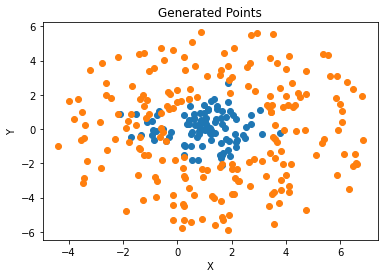

# Logistic_Regression_Model
Implementation of a **Logistic Regression** model, both **from scratch and by using scikit-learn**, and adding **L2 normalization**.

<h2>Part A</h2>

<h4>Logistic Regression From Scratch</h4>

Implementation of a logistic regression method on the **Stress-Lysis** dataset, and analysis of the confusion matrix, and Jaccard and F1 scores.

First, I split the data into train and test sets using NumPy:

```ruby
mask = np.random.rand(len(df)) <= 0.8
training_data = df[mask]
testing_data = df[~mask]
```

I define several functions in the code.

First, I implement the **sigmoid** function. Then, I implement a function for calculating the **weights** in each iteration.

I define a certian **learning rate** and **number of iterations**, and by having the temperature and humidity of the training data as the features, along with using the **gradient descent** method, I compute the weights by using the corresponding mathematical expressions.

The mentioned functions are as follows:

```ruby
def sigmoid(x)
def w_calc(data, label)
```

I define the final function as the classifier: I compute w for each class and by having the temprature and humidity of the testing data, I estimate a label for each of the testing samples. I use **one vs all** logistic regression by comparing the probability of each class, and then choose the class that has **max probability** as the estimated class.

```ruby
def classifier(training_data, test_data)
```

<h4>Computing different evaluation metrics:</h4>

The 3x3 **confusion matrix**:

Confusion Matrix =  [[130, 0, 0], [156, 0, 0], [103, 0, 0]]

Accuracy = 0.3341902313624679

F1 Score = 0.5009633911368016

Jaccard Score =  0.3341902313624679

<h4>Logistic Regression with scikit-learn</h4>

Now I try to implement the same problem by using python packages.

I use **OneVsRestClassifier** to simply calculate the accuracy of the one vs all logistic regression model:

```ruby
from sklearn.multiclass import OneVsRestClassifier
```

For calculating different evaluation metrics, sklearn library can be used as follows:

```ruby
from sklearn.metrics import confusion_matrix
from sklearn.metrics import jaccard_score
from sklearn.metrics import f1_score
```

Jaccard Score for the 3 classes: [0.92890995 0.9375     0.87567568]

Confusion Matrix:



F1 Score for the 3 classes: [0.92890995 0.9375     0.87567568]

A complete report of the regression model as below. As we see, the model has an **accuracy** of 0.93 which is pretty good.

```ruby
precision    recall  f1-score   support

        high       0.93      1.00      0.96       196
         low       0.94      1.00      0.97       120
         mid       1.00      0.88      0.93       185

    accuracy                           0.95       501
   macro avg       0.96      0.96      0.95       501
weighted avg       0.96      0.95      0.95       501
```

<h2>Part B</h2>

In this part I generated data for 2 different cases:

Case 1: 200 points inside a circle with a center of (1.5,0), and radius between 4-9, and 200 points inside a circle with a center of (1.5,0), and radius between 0-6

Case 2: 200 points inside a circle with a center of (1.5,0), and radius between 2-6, and 100 points with the mean of (1,0) for (X,Y), generated randomly with the standard deviation of 1.

For the first set, I define a function to plot random points of the first set, by using geometric relations of sin and cos for implementing the circular areas:

```ruby
theta = random.uniform(0,2*math.pi)
        radius = random.uniform(radius1,radius2)
        x = x_center + (radius * math.cos(theta))
        y = y_center + (radius * math.sin(theta))
``` 

The final results:



I plot the second set of dots by using the same function, and getting random points for normal distributions:

```ruby
x = np.random.normal(loc=1.0, scale=1.0, size=100)
y = np.random.normal(loc=0.0, scale=1.0, size=100)
```

The final results:



I use the same functions implemented in the previous part for calculating the weights, and classifying the data:

```ruby
def sigmoid(x)
def w_calc(train_data,class_1,class_2)
def classifier(train_data, test_data, class_1,class_2)
```
It can be seen that the accuracy is low, so I use the following functions to change the dimensions from 2 to 35:

```ruby
def x_dim_35(xi)
def w_dim35(train_data,class_1,class_2)
```

I define the new classifier by using the 35-dim data features. It can be seen that the accuracy improved by mapping the data into a higher dimensional space.


